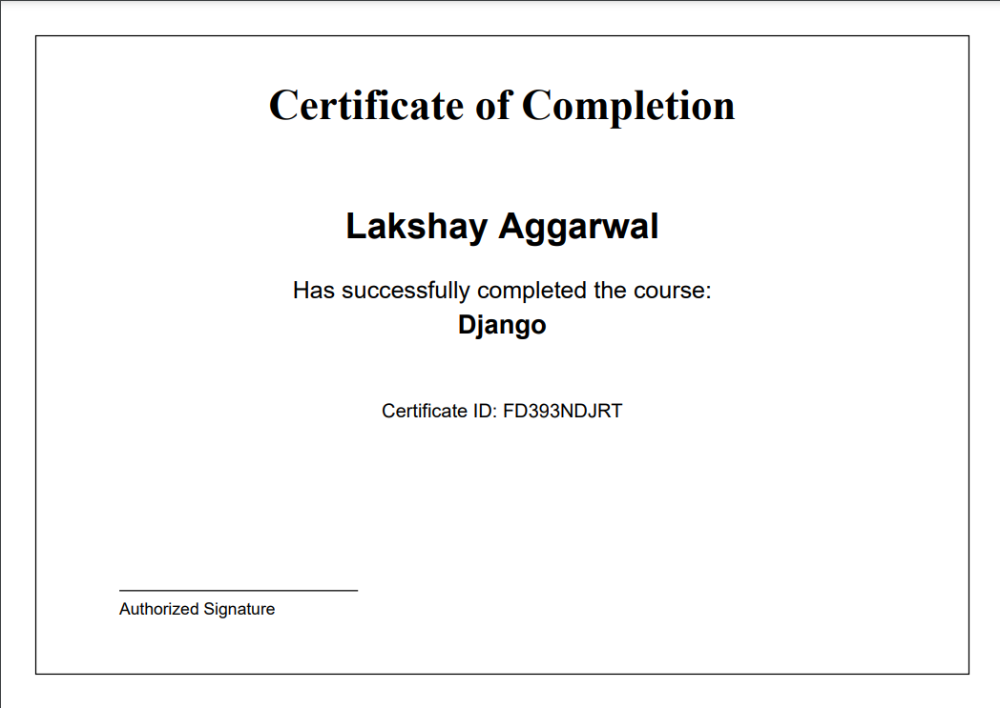

# Automated Certificate Submission & Verification System

## Overview

  
*Example of a generated certificate*


This project is a **Django-based web application** that allows organizations to **generate, distribute, and verify certificates** efficiently. Users can upload details, generate certificates in bulk, and verify issued certificates using a unique certificate ID.

## Features

- **User Authentication**: Supports login/logout for both staff and non-staff users.
- **Certificate Generation**: Bulk-generate certificates in **landscape PDF format** with a professional design.
- **User Dashboard**: Logged-in users can view and download their certificates.
- **Certificate Verification**: Verify certificates using a unique certificate ID.
- **Admin Panel**: Staff users can manage certificate records.
- **Secure Storage**: Certificates are stored securely in the server.

## Technologies Used

- **Django** (Backend Framework)
- **ReportLab** (PDF Generation)
- **SQLite / PostgreSQL** (Database)
- **Bootstrap / Tailwind CSS** (Frontend Styling)

## Installation

### Prerequisites:

- Python 3.x
- Django
- Virtual Environment (optional, but recommended)

### Setup:

```bash
# Clone the repository
git clone https://github.com/your-repo/certificate-system.git
cd certificate-system

# Create virtual environment
python -m venv venv
source venv/bin/activate  # On Windows use: venv\Scripts\activate

# Install dependencies
pip install -r requirements.txt

# Go to project Directory
cd Certificate

# Apply migrations
python manage.py migrate

# Create superuser (for admin access)
python manage.py createsuperuser

# Run the server
python manage.py runserver
```

## Usage

### Generating Certificates:

1. Log in as an admin.
2. Upload user details for certificate generation.
3. The system generates a PDF with a unique certificate ID.

### Verifying Certificates:

1. Users enter their certificate ID in the verification form.
2. The system checks the database and confirms authenticity.

### Viewing Certificates:

- Users can log in to view and download their issued certificates.

## Future Enhancements

- Email notification for issued certificates.
- QR code integration for easy verification.
- Support for multiple certificate templates.
- Cloud storage integration (AWS S3, Google Drive).

## License

This project is open-source and available under the MIT License.


